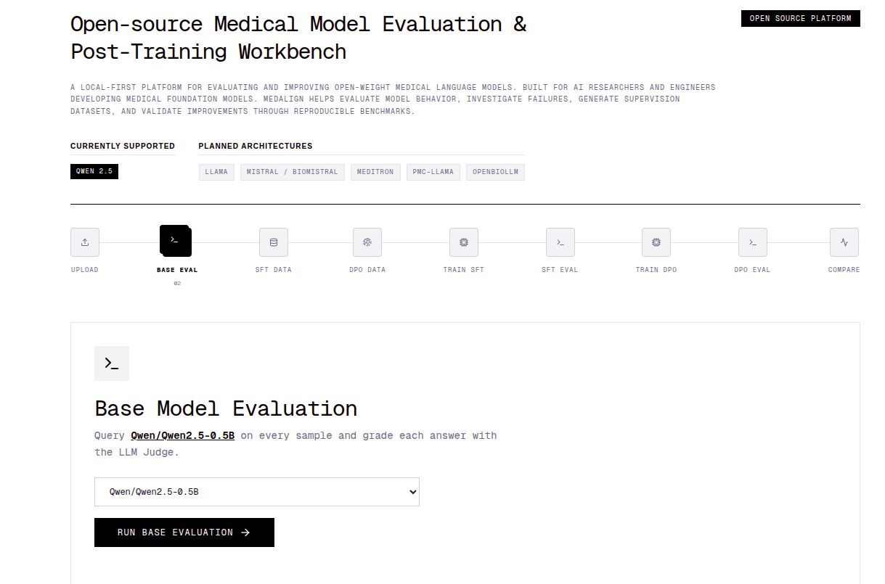
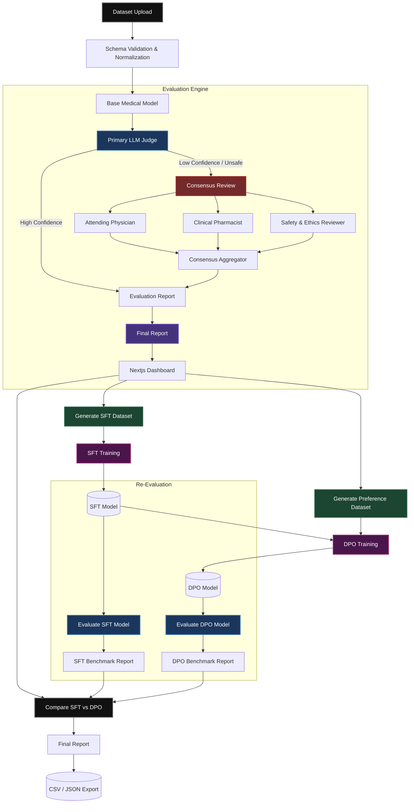

<div align="center">
  
# ⚕️ MedAlign 

**A Local-First Workbench for Evaluating, Investigating, and Post-Training SLMs & Medical Language Models.**

[](https://www.python.org/downloads/release/python-3100/)
[](https://opensource.org/licenses/MIT)
[](http://makeapullrequest.com)


</div>

MedAlign is an end-to-end local research pipeline for training and evaluating medical language models. <br/>

It allows you to ingest custom datasets, evaluate baseline models using LLM as Judge &  Agentic as Judge, automatically generate synthetic SFT & DPO datasets, and train/fine-tune models locally—all from a single, unified dashboard.
  
<br>



## What MedAlign Does

- **LLM as Judge:** Automatically evaluates thousands of medical predictions against clinical ground truths using a Chain-of-Thought Primary Judge, producing structured correctness and reasoning metrics.
- **Multi-Agent Consensus Eval:** Intelligently escalates low-confidence or unsafe predictions to a panel of three independent specialist agents (Attending Physician, Clinical Pharmacist, Safety Officer) to debate and synthesize a final verdict.
- **SFT & DPO Dataset Generation:** Automatically converts evaluation failures, edge cases, and consensus resolutions into high-quality, formatted JSONL datasets for supervised fine-tuning and preference learning.
- **SFT (Supervised Fine-Tuning):** Provides built-in tooling and workflows to run PEFT/LoRA fine-tuning on your generated failure-correction datasets to patch critical clinical knowledge gaps.
- **DPO (Direct Preference Optimization):** Integrates seamless preference alignment training (`trl` DPOTrainer) so your models learn not just what is correct, but which clinical rationale format is preferred.
- **Local-First Privacy:** Runs all evaluation agents (via Ollama) and inference generation (via HuggingFace) entirely on your local hardware to guarantee patient data privacy.

## System Architecture & Evaluation Flow

MedAlign employs a highly optimized, two-stage evaluation pipeline to balance speed and extreme clinical rigor. 

Every prediction passes through the **Primary LLM Judge**. If the prediction is safe and confident, it is recorded. If it triggers a safety flag or demonstrates poor clinical logic, it is escalated to the **Consensus Review System** where three specialized agents debate the outcome.



---

##  Getting Started

### Prerequisites
- Node.js 18+
- Python 3.10+
- [Ollama](https://ollama.ai/) installed and running locally.
- NVIDIA GPU (Recommended for running local transformers & training).

### 1. Install & Run Ollama Models
The evaluation engine relies on Ollama for fast, local LLM judging. Pull the recommended models:
```bash
ollama pull llama3.2:latest
# Optionally pull other variants for the consensus agents if you modify settings.py
```

### 2. Backend Setup (FastAPI Engine)
The backend handles dataset parsing, inference, agent orchestration, and DPO training via HuggingFace `trl`.

```bash
cd backend
python -m venv .venv
source .venv/bin/activate

# Install dependencies
pip install -r requirements.txt
pip install python-multipart

# Start the server
uvicorn app.main:app --reload --host 0.0.0.0 --port 8000
```

### 3. Frontend Setup (Next.js Dashboard)
The frontend is a strictly-typed React/Next.js application providing the visual workbench.

```bash
cd frontend
npm install

# Start the development server
npm run dev
```
Navigate to `http://localhost:3000` to access the MedAlign dashboard.

---

## ⚙️ Configuration & Adding Models

MedAlign uses `pydantic-settings` to manage configurations. The easiest way to customize the platform and change models is by creating a `.env` file in the root directory (alongside the `backend/` folder).

### Changing Evaluation Models (Ollama)
You can update the local Ollama models acting as the Evaluation Agents by adding the following to your `.env` file:

```env
# The Ollama models used by the Primary Judge and Consensus Agents
# (Provide a comma-separated list. If the first model fails, it automatically falls back to the next)
INFERENCE_OLLAMA_BASE_URL="http://localhost:11434"
INFERENCE_FALLBACK_MODELS="llama3.2:latest,mistral:latest,gemma:latest"
```

If these values are not present in your `.env` file, the system will safely fallback to the defaults defined in `backend/app/config/settings.py`.


## 🤝 Contributing

We welcome contributions from the open-source community, particularly from clinical researchers and AI engineers!

1. Fork the Project
2. Create your Feature Branch (`git checkout -b feature/AmazingFeature`)
3. Commit your Changes (`git commit -m 'Add some AmazingFeature'`)
4. Push to the Branch (`git push origin feature/AmazingFeature`)
5. Open a Pull Request

---

## 📄 License

Distributed under the MIT License. See `LICENSE` for more information.

<div align="center">
  <i>Built for the advancement of safe, open-source medical AI.</i>
</div>
